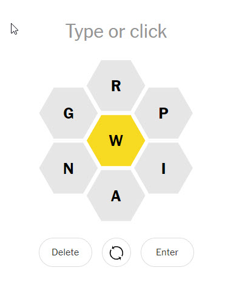

      

# Spelling Bee Resolver
<h4 align="center">Word finder for Speeling Bee game of New York Times</h4>

# Table of Contents

-   [About The Project](#about-the-project)
    -   [Built With](#build-with)
-   Getting Started
    -   Prerequisites
    -   Installation
-   Usage
-   Contributing
-   License
-   Contact
-   Acknowledgments

# About the project
Have you ever play to [Bee game](https://www.nytimes.com/puzzles/spelling-bee)? Have you ever been stuck? This is your copilot to inspire in hard moments by helping you in this game. 

## Build With
- 100% python3 development. 
# Getting Started 
Here explain what do you need to run this program.
## Prerequisites
- python3
- json package (via import)
- argparse (via import)
- json dictionary (in the project there is a some examples. Not all words are accepted by the game).
## Installation
No installation is required. Only python3 installed on your computer.
# Usage
```shell
python3 beeresolver.py -d <dictionary file> -m <mandatory_letter> -s <setofletters>
```
**Example**:
```shell
python3 beeresolver.py -d mydictionary.json -m w -s rpiang
```


# Contributing
Contributions are what make the open source community such an amazing place to learn, inspire, and create. Any contributions you make are  **greatly appreciated**.

If you have a suggestion that would make this better, please fork the repo and create a pull request. You can also simply open an issue with the tag "enhancement". Don't forget to give the project a star! Thanks again!

1.  Fork the Project
2.  Create your Feature Branch (`git checkout -b feature/AmazingFeature`)
3.  Commit your Changes (`git commit -m 'Add some AmazingFeature'`)
4.  Push to the Branch (`git push origin feature/AmazingFeature`)
5.  Open a Pull Request

# Licesense
Distributed under the MIT License. See LICENSE.txt for more information.
# Contact
- [coding.se6ky@passmail.net](mailto:coding.se6ky@passmail.net) 
- [Discord](https://discordapp.com/users/682980233657319463)
